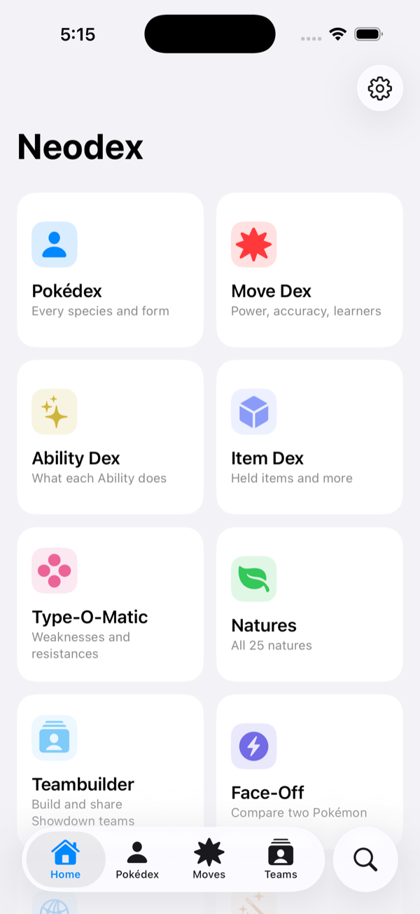
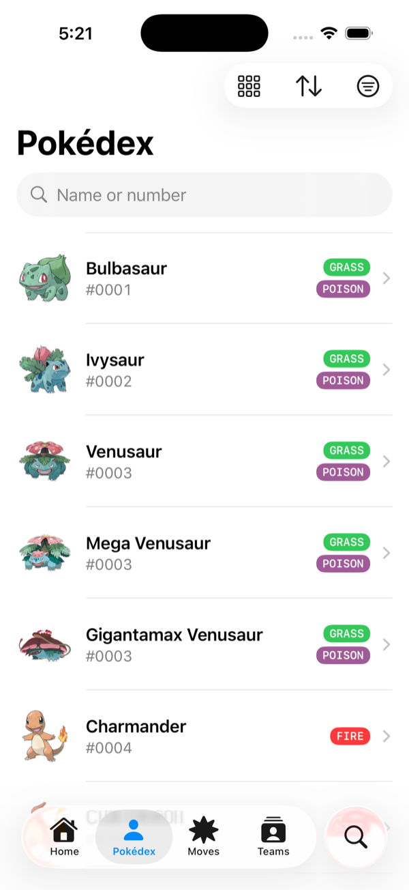
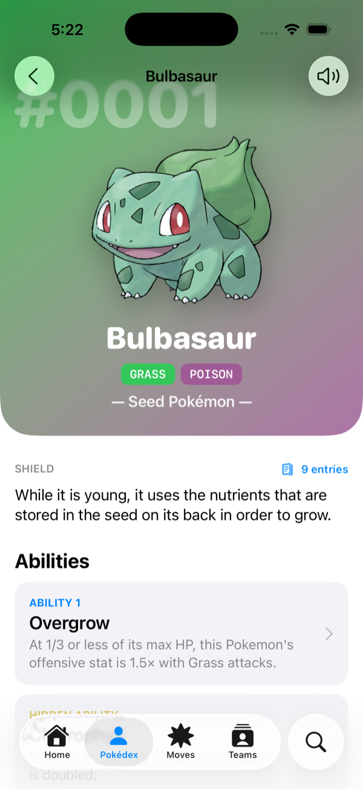
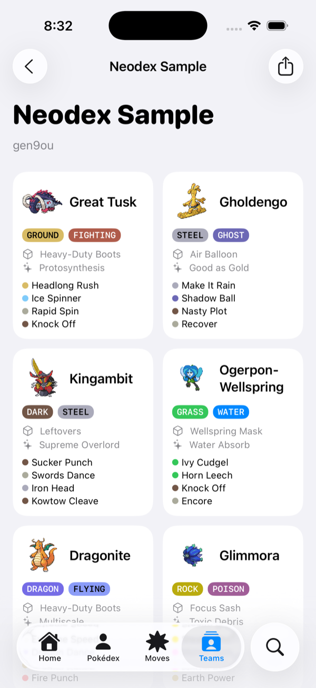
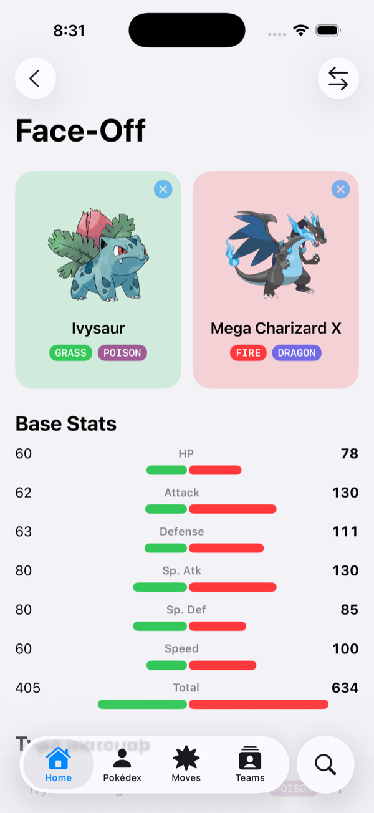
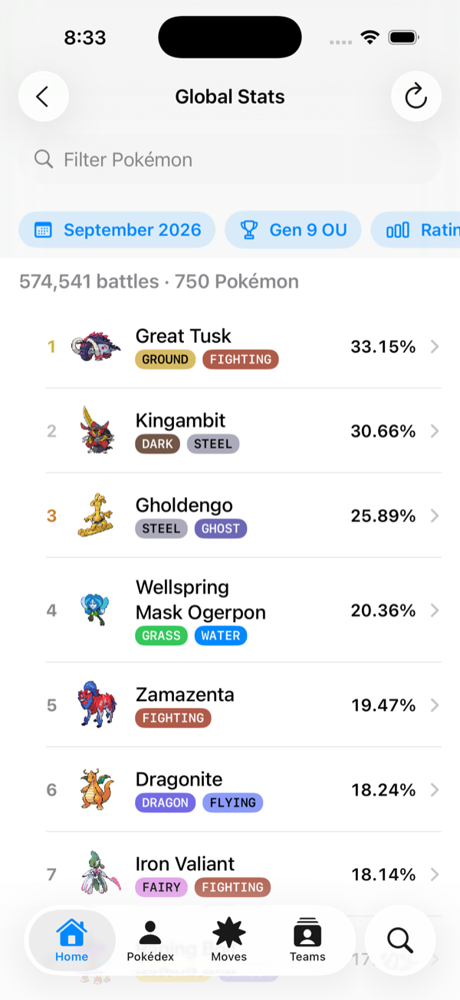

# Neodex

An offline Pokédex for iPhone and iPad with [Pokémon Showdown](https://play.pokemonshowdown.com) teambuilding. Every species and form through the current generation, every move, Ability and item, type matchups, Smogon usage statistics, and teams you can paste straight into Showdown.

<p>
  
  
  
  
  
  
</p>

## Features

- **Pokédex** — 1,025 species and 1,330 forms (Megas, Gigantamax, regional variants, Paradox Pokémon, the Legends: Z‑A Megas), with filters, sorting, a grid mode, and a detail screen covering Pokédex entries from every game, abilities, base stats, evolutions, forms, traits, type matchups, locations and the full learnset.
- **Move, Ability and Item dexes** — in‑game descriptions alongside Showdown's competitive summaries, TM numbers, and reverse lookups (every Pokémon that learns a move or has an ability).
- **Type‑O‑Matic** — combine up to two types and see exactly what they're weak to and resist.
- **Teambuilder** — build teams of six with an editor that only offers legal moves, live stat calculation, EV/IV controls, natures and Tera Types. Import teams from Showdown's export text and export them back, byte‑for‑byte compatible.
- **Face‑Off** — compare any two Pokémon side by side.
- **Global Stats** — Smogon usage rankings for any format and month, with abilities, items, moves, spreads, teammates and checks for every Pokémon.
- **Explore** — recently viewed, picks based on what you've been reading, and what's popular on Showdown right now.
- **Spotlight** — every Pokémon, move, Ability, item and nature is searchable from the Home Screen and deep‑links into the app.
- Fully offline except for Smogon statistics. Customisable tab bar, sidebar on iPad, Dynamic Type and dark mode throughout.

## How it's built

Neodex is three pieces sharing one set of Swift types; see [Docs/ARCHITECTURE.md](Docs/ARCHITECTURE.md) for the full picture.

| Piece | What it is |
| --- | --- |
| [`Packages/NeodexKit`](Packages/NeodexKit) | Platform‑independent Swift package: models, an in‑memory Pokédex database, the type chart and stat formulas, a native parser/exporter for Showdown's team format, Smogon statistics parsers. Covered by Swift Testing suites. |
| [`Tools/NeodexData`](Tools/NeodexData) | A Swift command‑line tool that regenerates the bundled dataset from [Pokémon Showdown](https://github.com/smogon/pokemon-showdown) and [PokeAPI](https://github.com/PokeAPI/pokeapi), verifies every cross‑reference, and produces compact HEIC artwork. One command refreshes everything. |
| [`App`](App) | The SwiftUI app. iOS 26 and later, Swift 6 with strict concurrency, SwiftData for teams and history, a single typed route for navigation and Spotlight deep links. |

The whole data bundle is about 49 MB, down from 454 MB of hand‑collected assets in the original app.

## Building

Requires Xcode 27 and an iOS 26+ simulator or device.

1. Open `Neodex.xcodeproj`.
2. Select the **Neodex** scheme and run.

The generated data and images are checked in, so the app builds without running the pipeline.

### Refreshing the data

```bash
cd Tools/NeodexData
swift run neodex-data                    # full refresh: data + images (about a minute)
swift run neodex-data --skip-images      # data only
swift run neodex-data --preview-fixture  # just the Xcode Previews fixture
```

### Tests

```bash
cd Packages/NeodexKit && swift test   # models, type chart, stat math, Showdown codec, Smogon parsers
cd Tools/NeodexData && swift test     # the data pipeline
```

The Xcode scheme also runs the kit tests plus the app's bundled‑data smoke tests (⌘U). Every screen has an Xcode Preview backed by a small fixture cut from the real dataset.

## Data sources and licensing

- Competitive data (species, moves, abilities, items, learnsets, tiers, descriptions): [Pokémon Showdown](https://github.com/smogon/pokemon-showdown), MIT.
- In‑game descriptions, Pokédex entries, encounter data and official artwork: [PokeAPI](https://github.com/PokeAPI/pokeapi) and [PokeAPI/sprites](https://github.com/PokeAPI/sprites), BSD‑3‑Clause.
- Battle sprites and item icons: [Pokémon Showdown](https://play.pokemonshowdown.com/sprites/).
- Usage statistics: fetched live from [Smogon](https://www.smogon.com/stats/).

Neodex is a fan‑made reference. Pokémon and all related names and artwork are trademarks of Nintendo, Game Freak and The Pokémon Company; Neodex is not affiliated with or endorsed by them.

## History

Neodex started in late 2020 as one of my first SwiftUI projects, with data copied by hand from the web. In 2026 it was rebuilt from the ground up for iOS 26 with a reproducible data pipeline while keeping the original feature set and design language. The original code is preserved in this repository's history (`4152ff4`).
